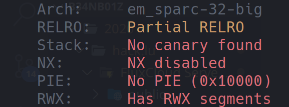
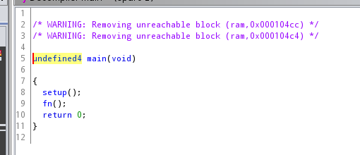
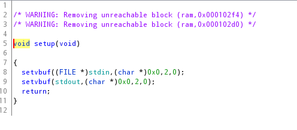
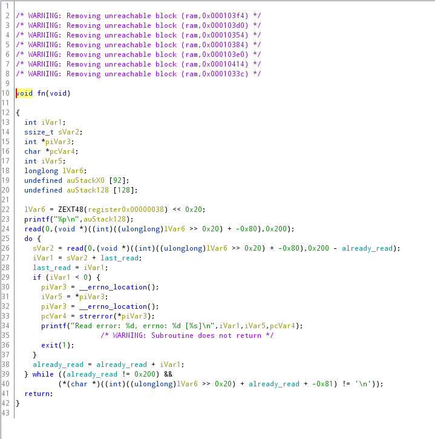

# Secret Pwnhub Academy Rewards Club

 

```txt
There are several secret clubs around, the most important of which is the select few who can deal with all shades of grey of CPU architectures. This is the golden opportunity to look at another one!

file: https://pwnhub.fluxfingers.net/static/chall/secret-pwnhub-academy-rewards-club-1_0226d54c17fd53005596f4ff42b51940.zip
nc flu.xxx 2020
```

---

## TL;DR

Pass a long enough input string to the service to change the function's return pointer. Redirect code execution to the beginning of this string, where you have your shellcode.

Something like the following will do just fine (`exploit.py` can be found [here](./exploit.py)):

```txt
b'-\x0b\xd8\x9a\xac\x15\xa1n/\x0b\xdc\xda\x90\x0b\x80\x0e\x92\x03\xa0\x08\x94"\x80\n\x9c\x03\xa0\x10\xec;\xbf\xf0\xd0#\xbf\xf8\xc0#\xbf\xfc\x82\x10 ;\x91\xd0 \x10XXXXXXXX\xff\xff\xebxXXXXXXXXXXXXXXXXXXXXXXXXXXXXXXXXXXXXXXXXXXXXXXXXXXXXXXXXXXXXXXXXXXXXXXXXXXXXXXXXXXXXXXXXXXXXXXXXXXXXXXXXXXXXXXXXXXXXXXXXXXXX\xff\xff\xebx\xff\xff\xebp'
```

## Detailed

First of all, a simple `file` will tell us, what the task description meant by "[...] all shades of gray of CPU architectures. [...]":

```txt
sparc-1: ELF 32-bit MSB executable, SPARC, version 1 (SYSV), statically linked, not stripped
```

... I personally had never heard of or worked with the `SPARC` architecture before, so I did a quick google search to get some more insight.

As it turns out, `SPARC (Scalable Processor Architecture)` was one of the first successful `RISC` architectures and it was originally developed by `Sun Microsystems` (that sounds familiar, doesn't it... ^^) back in 1986! Also interesting to note: It's a `big endian` architecture.

Alright! After this freshening up on processor architectures and computer history, it was time to start looking at the binary itself... Actually, nevermind, let's first look at what security measures are enabled by using `pwntools`' `checksec` tool:



... wow... not bad... not bad at all ^^ - we'll definitely keep this in mind for later. Now... we can really start taking a look at the binary - let's fire up `Ghidra`:



... okay... not too much happening in the main function itself. Let's take a look at the two functions it's calling:





... _hmm_ ... the `setup()` function isn't too interesting either - it just seems to make both `stdin` and `stdout` unbuffered.

The `fn()` function seems to be more interesting, but... `Ghidra`'s decompiled code is a bit weird here... So... we decided to do some dynamic analysis with the already provided `run_docker_gdbserver.sh` script.

Run the script, connect to it with `nc localhost 4444` set a breakpoint after the first call to `read()`, continue, enter something like `AAAABBBBCCCCDDDD` and take a look at the stack:


... hang on... that address looks familiar! Right... taking a look at the process' output will confirm this suspicion:


... there it is again! That means the cryptic `Ghidra` decompilation was trying to say that the input is being read into the `auStack128` array, since this is the one whose address is printed.

Well... this makes the `fn()` function all the more interesting! If `read()` reads input into the `auStack128` buffer, then it's in fact reading a maximum of `0x200` bytes (`512 bytes`) into a buffer that is only `128 bytes` large - we can definitely overflow that!

It was at this point that we felt a bit lost, since we didn't know too much about the `SPARC` architecture and where, or even if, it stores the function return pointers on the stack.

In the end, we simply used the `pwntools.cyclic()` function to generate a 512 byte `De Bruijn sequence` and passed it as input to the `sparc-1` process that had GDB attached. Now we simply had to see if the execution fails and where it fails:


... ok... execution definitely fails. However, it's a SIGSEV... so the program tried to access some illegal memory adddress. Let's see what the instruction that caused this is:


... well... we've definitely overwritten the main function's frame pointer.


Simply pass this hex value (`0x76616162`) to the `pwntools.cyclic_find()` function (don't forget to use the proper arch - otherwise the endianess might be incorrect) and find the frame pointer's offset from the beginning of the input buffer - as it turn out, it begins after `184 bytes`.

That's all nice and dandy, but, to be frank, we were more interested in the `program counter`. Some research told us that `SPARC` uses the `o7` and `i7` registers to save the next return addresses. Let's have a look at them in our crashed program:


... would you look at that! Once again, the `cyclic_find()` function is here to help: it would seem that the main function's return pointer is stored on the stack, just `188 bytes` after the beginning of the input buffer.

Okay! This is already pretty much enough to create a fully functioning exploit! The only thing missing now was some shellcode to redirect execution to! We found that on [shell-storm.org](http://shell-storm.org/shellcode/files/shellcode-83.php).

If you want to take a look at the final `exploit.py` script, you'll find it [here](./exploit.py). Here's a short summary of what it does:

1. read the address of the char array on the stack from the process' output
2. construct an exploit string with shellcode at the beginning (padded to a length of 184 bytes).
3. append the address of the char array to this exploit string - this will eventually overflow into the the `frame pointer`.
4. append the address of the char array - 8 to the exploit string - the `retl` instruction at the end of the main function will eventually return to this address + 8 (that's just a thing with the `SPARC` architecture)

... and... after running this final script... we get our beautiful shell which we can use to simply cat the flag: `flag{all_the_!nput_to_0utput_register_sh0veling}`
